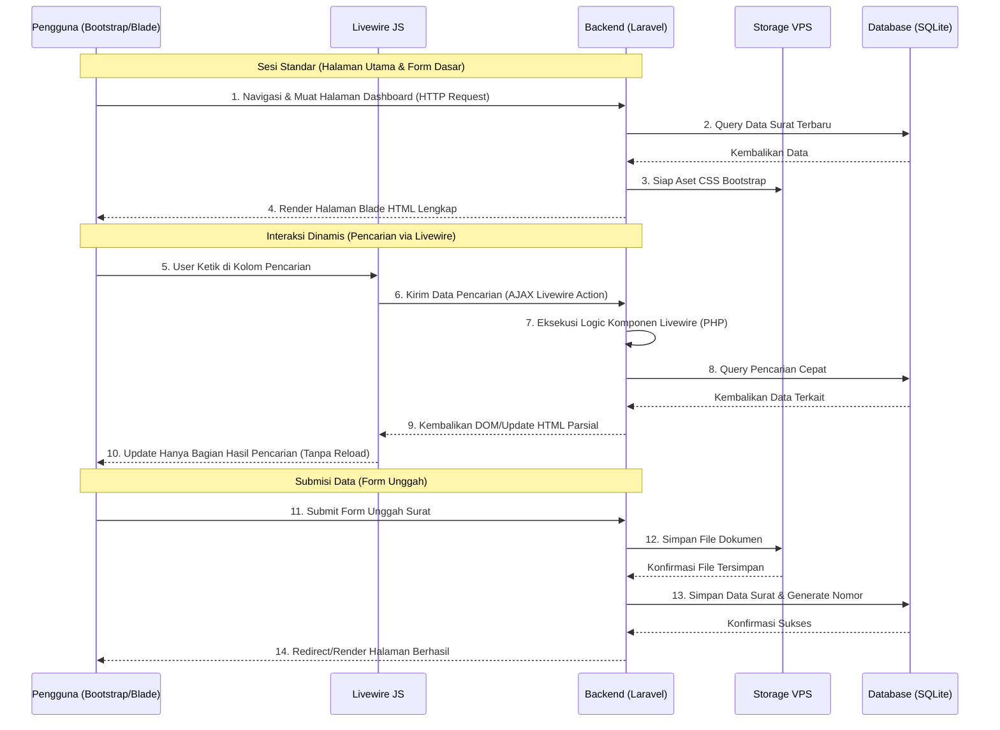
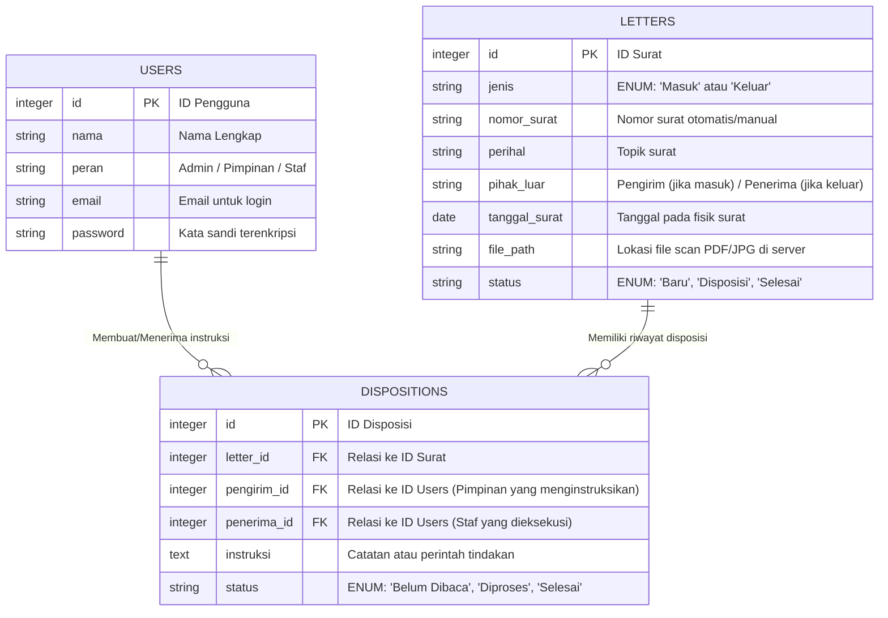

# PRD — Project Requirements Document

## 1. Overview

Aplikasi ini adalah sistem manajemen arsip surat masuk dan keluar yang dirancang khusus untuk instansi pemerintahan. Saat ini, pengelolaan surat manual seringkali memakan waktu, rentan hilang, dan sulit dilacak. Tujuan utama dari aplikasi ini adalah untuk mendigitalisasi proses administrasi sehingga menjadi jauh lebih cepat dan teratur. Dengan aplikasi ini, instansi dapat menjamin keamanan dokumen, mempercepat proses disposisi (penerusan instruksi antar pejabat/staf), dan yang terpenting, memungkinkan pengguna untuk mencari dokumen lama secara instan dan melihat status surat secara real-time.

## 2. Requirements

- **Digitalisasi Dokumen:** Sistem harus bisa menerima unggahan file berupa PDF atau hasil scan (JPG) untuk menyimpan bentuk fisik surat secara digital.
- **Otomatisasi:** Sistem wajib memiliki kemampuan men-generate (membuat) nomor surat secara otomatis berdasarkan format baku pemerintahan untuk menghindari penomoran ganda.
- **Kemudahan Akses (First Win):** Pengguna harus dapat langsung melihat daftar surat masuk dan keluar yang rapi dan terstruktur begitu masuk ke dalam aplikasi.
- **Kecepatan Pekerjaan:** Menggantikan proses disposisi kertas dengan disposisi elektronik agar instruksi pimpinan bisa langsung diterima oleh staf terkait tanpa harus menunggu kurir antar ruangan.
- **Responsitas Interaktif:** Menggabungkan tampilan statis Bootstrap dengan interaktivitas dinamis menggunakan Livewire, memungkinkan fitur pencarian dan pembaruan status tanpa _full reload_ halaman.
- **Penyimpanan Lokal:** Karena menggunakan SQLite dan VPS, aplikasi dikonfigurasi untuk berjalan maksimal pada skala instansi tunggal dengan efisiensi biaya.

## 3. Core Features

- **Pemindaian & Unggah Dokumen:** Fitur untuk mengunggah surat fisik yang telah di-scan ke format PDF atau JPG secara langsung ke dalam sistem.
- **Penomoran Surat Otomatis:** Fitur pintar yang memberikan nomor surat keluar secara otomatis mengikuti urutan dan kode klasifikasi instansi.
- **Disposisi Elektronik:** Pimpinan dapat memberikan catatan, instruksi, dan meneruskan surat ke staf spesifik secara digital, lengkap dengan notifikasi.
- **Pelacakan Status Surat:** Indikator visual untuk melihat di mana posisi surat saat ini (misal: "Menunggu Disposisi Pimpinan", "Sedang Diproses Staf", atau "Selesai").
- **Pencarian Cepat (Livewire):** Fitur pencarian yang diperkaya oleh **Laravel Livewire**, menampilkan hasil pencarian surat secara _real-time_ saat pengguna mengetik tanpa memuat ulang halaman web secara keseluruhan.
- **Dasbor Daftar Surat:** Tampilan utama yang menyajikan rangkuman dan daftar surat masuk/keluar terbaru yang dimuat dengan cepat menggunakan template Blade dan distyling oleh Bootstrap.

## 4. User Flow

1. **Login:** Pengguna masuk sesuai peran mereka (Admin Tata Usaha, Pimpinan, atau Staf) melalui halaman autentikasi standar.
2. **Pencatatan Surat Masuk:** Admin Tata Usaha menerima surat fisik -> Mengunggah file PDF/JPG ke aplikasi -> Memasukkan detail surat (pengirim, perihal) -> Aplikasi menyimpannya.
3. **Proses Disposisi:** Pimpinan membuka aplikasi -> Melihat surat masuk baru di dasbor -> Membaca detail surat -> Memilih opsi "Penerima Disposisi" (staf) & menuliskan instruksi -> Klik kirim.
4. **Tindak Lanjut & Status:** Staf menerima tugas -> Memproses surat -> Mengubah status surat menjadi "Selesai". Aksi ini diperbarui langsung di tampilan tanpa reload halaman penuh.
5. **Pencarian:** Kapan pun dibutuhkan, pengguna menggunakan kolom pencarian di bagian atas aplikasi. Berkat **Livewire**, hasil pencarian muncul detik itu juga saat pengguna mengetik tanpa menunggu pemindahan halaman.

## 5. Architecture

Aplikasi ini menggunakan arsitektur web modern namun monolitik. **Bootstrap** digabungkan dengan **Laravel Blade** untuk menyusun antarmuka pengguna. Yang membedakan arsitektur ini adalah adanya integrasi **Laravel Livewire** sebagai jembatan antar frontend dan backend. Livewire memungkinkan komponen frontend berinteraksi dengan backend Laravel secara tersembunyi (AJAX), mengirimkan data request, menjalankan logika PHP, dan mengembalikan potongan HTML baru untuk diperbarui di sisi browser users. Hal ini memberikan pengalaman _Single Page Application_ (SPA) yang mulus, namun tetap menjaga struktur backend dan keamanan standar Laravel.

## 6. Database Schema

Untuk menjalankan aplikasi ini, kita membutuhkan tiga entitas utama: Data Pengguna, Data Surat, dan Data Disposisi (Riwayat perjalanan surat).

- **USERS (Pengguna):** Menyimpan data staf dan pimpinan yang menggunakan aplikasi.
- **LETTERS (Surat):** Menyimpan informasi utama tentang surat yang masuk maupun keluar.
- **DISPOSITIONS (Disposisi):** Menyimpan rekam jejak instruksi dari atasan ke bawahan terkait suatu surat tertentu.

## 7. Tech Stack

Berdasarkan kebutuhan instansi dan efisiensi, teknologi yang dipilih adalah:

- **Frontend:**
  - **Bootstrap:** Framework CSS untuk komponen UI responsif dan cepat pengembangan.
  - **Laravel Livewire:** Library PHP untuk frontend dinamis. Livewire menggantikan kebutuhan JavaScript framework yang berat, memungkinkan fitur pencarian real-time dan update status tanpa reload halaman, namun tetap menggunakan sintaks PHP yang familiar bagi developer Laravel.
- **Backend:** Laravel (Framework PHP yang mengelola routing, logika bisnis, dan koneksi database).
- **Database:** SQLite (Database ringan berbasis file untuk efisiensi operasional).
- **Deployment:** VPS (Virtual Private Server).
